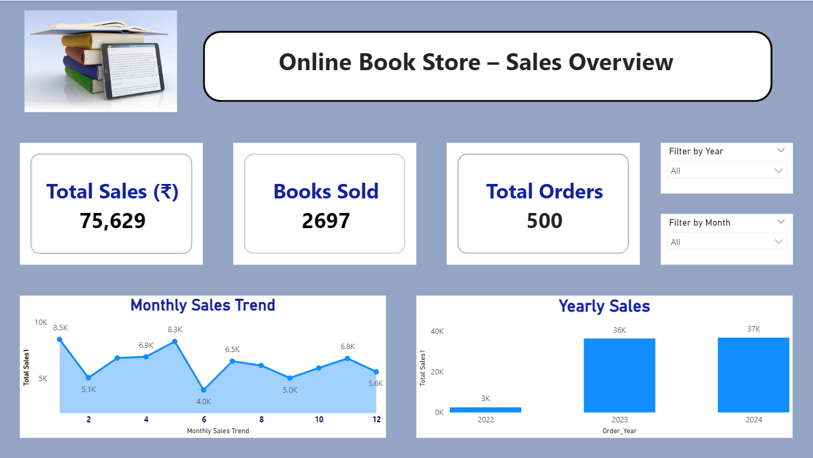
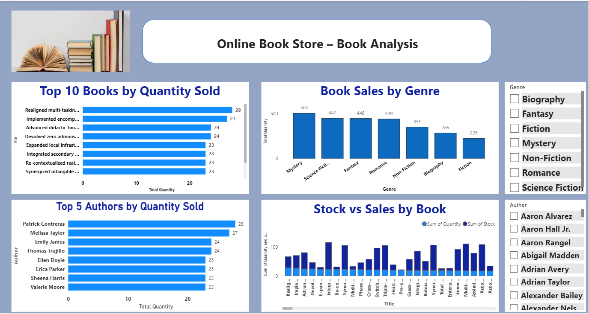
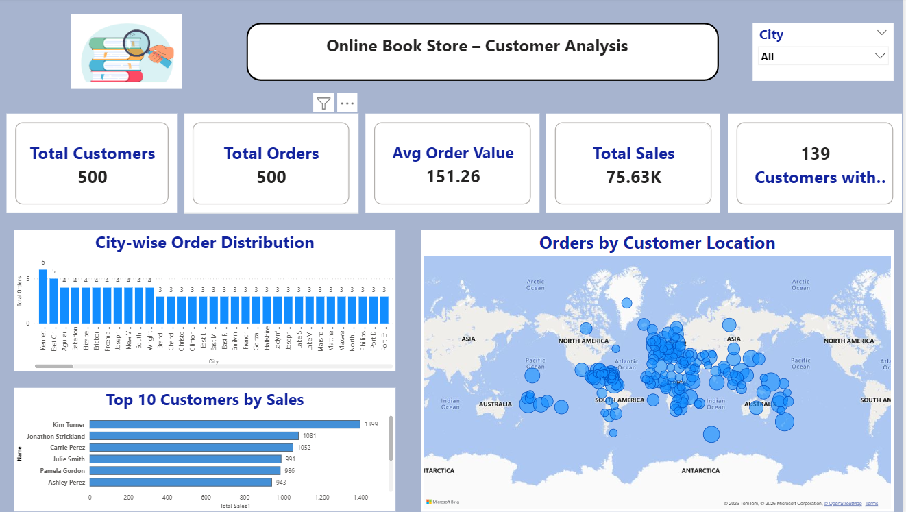

# 📘 Online Book Store – Sales & Customer Analysis  

## 📌 Project Overview  

This is an End-to-End Data Analytics project built using **Python, MySQL, and Power BI**.  
The project analyzes an online bookstore dataset to generate insights into sales performance, customer behavior, and book trends to support data-driven business decisions.

---

## 🎯 Project Objectives  

- Analyze overall sales performance  
- Identify top-selling and slow-moving books  
- Perform genre-wise and author-wise analysis  
- Analyze customer distribution and buying patterns  
- Generate business insights for revenue growth and inventory optimization  

---

## 🛠 Tools & Technologies Used  

- **Python (Pandas)** – Data Cleaning & Preprocessing  
- **MySQL** – Database Creation & Management  
- **SQL** – Table Design & Relationships  
- **Power BI** – Dashboard Development  
- **DAX** – KPI & Business Metrics Calculation  
- **Data Modeling (Star Schema)**  

---

## 📂 Dataset Files  

- books_clean.csv  
- customers_clean.csv  
- orders_clean.csv  

---

## 🔄 Project Workflow  

### 1️⃣ Data Cleaning (Python)  

- Removed missing values  
- Removed duplicate records  
- Standardized column names  
- Formatted date columns  
- Prepared cleaned datasets for database loading  

---

### 2️⃣ Database Design (MySQL)  

- Created `bookstore` database  
- Designed tables: Books, Customers, Orders  
- Defined Primary and Foreign Key relationships  
- Loaded cleaned data into MySQL  

---

### 3️⃣ Data Modeling (Power BI)  

- Connected Power BI to MySQL database  
- Imported tables  
- Built Star Schema model  
  - Fact Table: Orders  
  - Dimension Tables: Books, Customers  

---

## 📊 DAX Measures Created  

Total Sales = SUM(orders[Total_Price])

Total Orders = COUNT(orders[Order_ID])

Books Sold = SUM(orders[Quantity])

Average Order Value = DIVIDE([Total Sales], [Total Orders])

## 🚀 Key Skills Demonstrated

Data Cleaning & Preprocessing

SQL & Database Design

Data Modeling (Star Schema)

DAX Calculations

Interactive Dashboard Development

Business Insight Generation

## 📸 Dashboard Screenshots
🔹 Sales Overview Dashboard

This dashboard provides a complete overview of total sales, total orders, books sold, and monthly & yearly sales trends.

🔹 Book Performance Analysis

This page highlights top 10 books, genre-wise performance, author analysis, and stock vs sales comparison.

🔹 Customer Analysis Dashboard

This dashboard analyzes customer distribution, top customers, city-wise orders, and average order value.

🔹 Business Insights & Recommendations

This section identifies top-selling and slow-moving books and provides data-driven recommendations for revenue growth and inventory optimization.

## 📌 Conclusion

This project demonstrates a complete real-world data analytics workflow:

Raw Data → Data Cleaning → Database → Data Modeling → Dashboard → Business Insights
